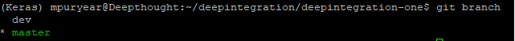

# GitHelper

## How-To simple Commands

### How to clone a repository:

Create a local directory to hold the repo
```
mkdir koret
cd koret/
```

Go to the website of the repo and get the clone url


clone the repo into your directory
```
git clone https://github.com/SonomaDeepThought/deepintegration-one.git
```

### How to commit changes made

When you commit your code, you have to choose which files to commit. This is often a two-step process that requires the user to call _git add ._ followed by _git commit -m "message"_ but we can/should condense this to a single command
```shell
git commit -am "message"
```
The -a tells the commit to add all modified files. 


### How to checkout and create branches

The first thing you do before working is check which branch you are working from
```
git status
```


-OR-

git branch will list all the branches as well as the current branch
```
git branch
```




Once you see which branch you are on, you can change to the branch you would like to work on
```
git checkout branchname
```

To create a new branch from a branch (this is what we do since we only work off dev)
```
git checkout -b newBranch oldBranch
```
In our case:
```
git checkout -b newFeature dev
```

To be able to push your work in the new branch to GitHub we have to set the upstream
```
git push --set-upstream origin newBranch
```
Now anyone with access to the repo should be able to see and access the newly created branch


