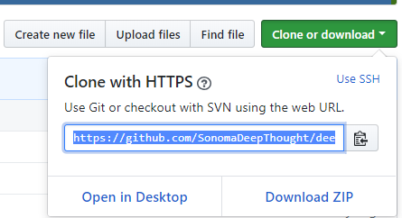
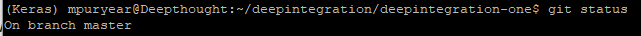

# GitHelper

## How-To simple Commands

### How to clone a repository:

Create a local directory to hold the repo
```
mkdir koret
cd koret/
```

Go to the website of the repo and get the clone url



clone the repo into your directory
```
git clone https://github.com/SonomaDeepThought/deepintegration-one.git
```

### How to commit changes made

When you commit your code, you have to choose which files to commit. This is often a two-step process that requires the user to call _git add ._ followed by _git commit -m "message"_ but we can/should condense this to a single command
```shell
git commit -am "message"
```
The -a tells the commit to add all modified files. 


### How to checkout and create branches

The first thing you do before working is check which branch you are working from
```
git status
```

